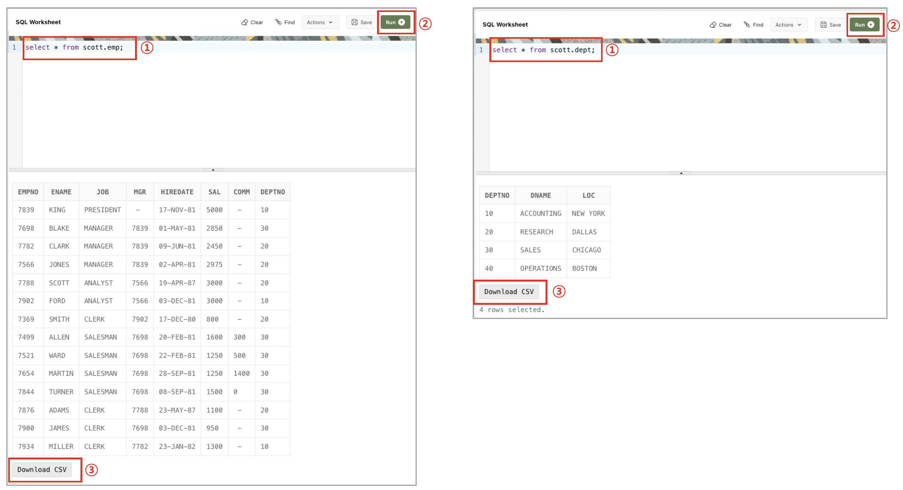
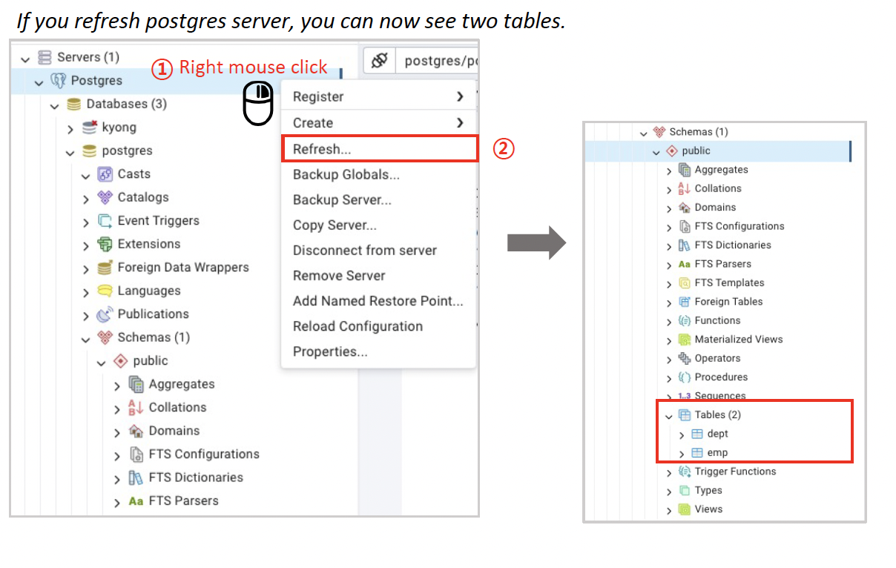
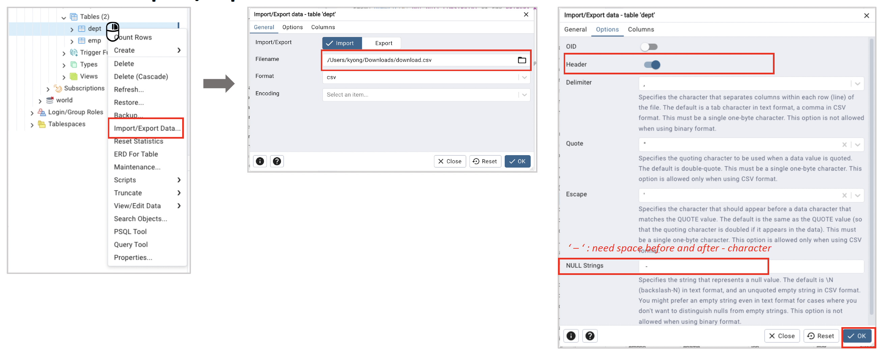

## SQL Practice

> 해당 github 파일은 sql_nl2sql.pdf 파일을 기준으로 작성하였습니다.

- **목적**: 기본SQL 문법 연습

### Export CSV File

- oracle에는 scott/tiger 계정이 기본 제공됨.
- 따라서 oracle을 web-based로 제공하는 LiveSQL에서 scott/tiger 계정 데이터를 다운받을 수 있음.
- **CSV 파일 Export 방법:**
  1. LiveSQL 로그인
  2. SQL Worksheet 클릭
  3. `select * from scott.emp;`, `select * from scott.dept;` 각각 실행
  4. 데이터 맨 밑에 `Download CSV` 버튼 클릭
     

### Start Postgres

- postgres에서 실습하기 앞서, postgres 프로세스를 실행시켜야 함.
- 실습에서는 pgAdmin을 사용하지만, 다른 여러 데이터베이스 툴을 써도 무방함. (Ex. DBeaver)
- **[MAC]**
  - `postgres` application 실행 (`start` 버튼 클릭 필요)
  - `pgAdmin` application 실행
  - `pdAdmin` 상단의 `Tools` 클릭 > `Query Tool` 클릭 > SQL문 입력창 뜸
  - - 모든 sql문은 입력 후 `execute script (►)` 버튼을 클릭하면 됨.
- **[Windows]**
  - 시작창에서 `pgAdmin` 찾아서 실행
  - `pdAdmin` 상단의 `Tools` 클릭 > `Query Tool` 클릭 > SQL문 입력창 뜸
  - 모든 sql문은 입력 후 `execute script (►)` 버튼을 클릭하면 됨.

### Import CSV File

- postgres의 `import/export data`는 스키마가 있는 상태를 가정하기 때문에 스키마가 제대로 생성되지 않은 경우 csv import가 불가함.
  <br/>

1. **CREATE TABLE**

```sql
  -- DEPT table
  CREATE TABLE if not exists DEPT (
      DEPTNO numeric(2) not null CONSTRAINT PK_DEPT PRIMARY KEY,
      DNAME VARCHAR(14),
      LOC VARCHAR(13)
  )
```

```sql
-- EMP table
CREATE TABLE if not exists EMP (
  EMPNO numeric(4) not null CONSTRAINT PK_EMP PRIMARY KEY,
  ENAME VARCHAR(10),
  JOB VARCHAR(9),
  MGR numeric(4),
  HIREDATE DATE,
  SAL numeric(7,2),
  COMM numeric(7,2),
  DEPTNO numeric(2) CONSTRAINT FK_DEPTNO REFERENCES DEPT
)
```

- `Query Tool`에서 위 쿼리들 실행 후 refresh해줘야 테이블 정보를 볼 수 있음. (경우에 따라 여러번 시도해야 할수도 있음)
  
- 제대로 테이블이 잘 생성됐는지 확인하기 위해서는 `SELECT * FROM emp;` `SELECT * FROM dept;` 쿼리 실행하면 됨. 만약 제대로 생성되었다면, 컬럼명이 뜰것임. 아직 데이터 import는 하지 않았기 때문에 데이터는 하나도 없을 것임.

2. **Import CSV**

- csv를 import하고 싶은 테이블에 마우스를 올리고 우클릭 > `Import/Export Data...`클릭
- **(주의)** csv 파일을 보고 어떻게 데이터를 정제해서 import할지 정해주어야 함.
  예를 들어 현재 liveSQL에서 다운로드 받은 csv 파일은 header가 있고, null string은 " - "로 되어있음. 이를 모두 고려하여 import하여야 함.
  

- 테이블이 제대로 import 됐는지 확인하기 위해서는 `SELECT * FROM emp;` `SELECT * FROM dept;` 실행.
- **(주의)** 테이블은 dept -> emp 순으로 import해야함. 이유는 emp와 dept 테이블의 deptno 컬럼이 서로 pk-fk로 연결되어있기 때문. <br/>예를 들어서 dept 테이블의 데이터가 하나도 없는 상태로 emp 테이블의 데이터 중 (deptno가 10이고 empno 1인 사원)을 insert하려고 하면, dept테이블에는 deptno가 10인 데이터가 하나도 없기 때문에 참조무결성 에러로 튜플 insert가 불가함. <br/> 따라서 dept 테이블 데이터의 insert가 emp 테이블 데이터의 insert보다 선행되어야 함.
- 만약 emp 테이블 insert시 hiredate에서 문제가 생긴다면, 다음 파일을 사용해보시기 바랍니다. ([File](./emp.csv))

### SELECT문

- 테이블이 제대로 import됐다는 가정하에, 다양한 select문을 연습해볼 수 있음. (sql은 where절 안의 string값 빼고 대소문자 구분 x)

  ```sql
  select * from emp where job not in ('PRESIDENT', 'MANAGER');
  ```

  ```sql
  select max(sal) from emp;
  ```

  ```sql
  select * from emp where deptno in (
   select deptno from emp where ename = 'JAMES'
  );
  ```

  ```sql
  select emp.ename, emp.deptno, dept.loc from emp
  join dept on emp.deptno = dept.deptno
  where emp.ename = 'KING';

  -- 아래 sql문과도 동일함.
  -- (즉, 테이블 전체에서 unique한 컬럼명은 select문에서 그냥 작성해도 되지만, deptno처럼 여러 테이블에 나오면 어느 테이블의 값을 가져다 쓸지 명시해야함)
  select ename, emp.deptno, loc from emp
  join dept on emp.deptno = dept.deptno
  where emp.ename = 'KING';
  ```

## Tuple Insert, Delete, Update

- 작성한 sql문이 제대로 실행되었는지 확인하기 위해서는 `SELECT * FROM EMP`, `SELECT * FROM DEPT` 쿼리 사용.

#### Insert

- Insert syntax
  ```sql
  INSERT INTO table_name (column1, column2, ...)
  VALUES (value1, value2, ...);
  ```
- Example

  ```sql
  INSERT INTO emp VALUES
  (1234, 'AAA', 'MANAGER', NULL, '2024-03-28', 3000.00, null, 10);
  ```

#### Update

- Update Syntax
  ```sql
  UPDATE table
  SET column1 = value1, column2 = value2, ...
  WHERE condition;
  ```
- Example

  ```sql
  update emp set sal = 10000.000 where ename = 'KING'
  ```

#### Delete

- Delete Syntax

  ```sql
    DELETE FROM
    table_name
    WHERE condition ;
  ```

- Example

  ```sql
  delete from emp where ename = 'AAA';
  ```

## Drop Table

- Syntax
  ```sql
  drop table [if exists]
  table_name [cascade | restrict];
  ```
- 단순히 `drop table dept;`를 실행하면 에러가 뜸 > 이유는 pk-fk로 emp 테이블과 연결되어 있기 때문에 dept 테이블 내의 데이터를 모두 삭제 시 emp 테이블의 참조무결성이 깨지기 때문.
- 따라서, `drop table dept cascade`라는 쿼리를 통해 dept 테이블과 관계가 있는 참조 제약 조건에 대해서도 삭제해야 함.
- 만약 테이블 스키마는 남기고 데이터만 모두 삭제하고 싶을 때, (CREATE TABLE까지만 실행했을 때처럼 테이블 컬럼만 보이는 상태, 데이터는 하나도 없는 상태를 의미) 사용하는 쿼리는 `truncate`임. `truncate emp;` 를 실행시키면 emp 테이블 내의 모든 데이터가 삭제됨.
